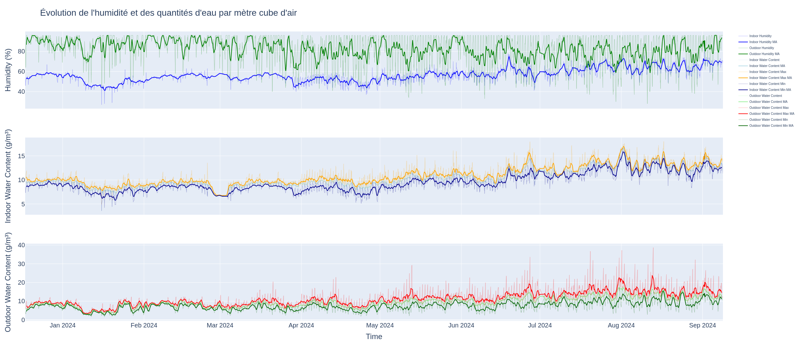
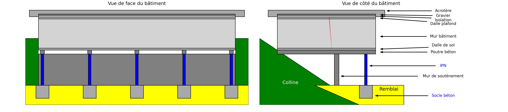

# Analyse et Modélisation des Causes d'une Fissure

## Description succincte du projet
Une fissure est apparue dans un bâtiment, et des mesures ont été effectuées sur le mur d'un bureau afin de comprendre son évolution. L'objectif de ce projet est d'analyser cette fissure à l'aide des données météorologiques, structurelles et d'autres variables explicatives. Ce dashboard permet de visualiser ces données et d'aider à établir la cause de l'apparition de la fissure, ainsi que les raisons pour lesquelles les travaux réalisés en 2016 n'ont pas permis de la corriger définitivement.

### Problèmes résolus :
- Suivi de l'évolution de la fissure dans le temps.
- Analyse des causes potentielles en utilisant des variables explicatives (météorologiques et structurelles).
- Modélisation des facteurs influençant la réapparition de la fissure.

### Finalité :
Ce dashboard permet aux experts d'examiner les données et de déterminer la cause de la fissure afin d'identifier le traitement approprié pour éviter sa réapparition future.

---

## Table des matières
- Introduction
- Prérequis
- Installation
- Utilisation
- Fonctionnalités principales
- Structure du projet
- Contribution
- Licence
- Exemples de Figures

---

### Introduction
Ce projet a été développé pour analyser et modéliser l'évolution d'une fissure apparue dans un bâtiment. Les variables explicatives utilisées incluent des données météorologiques recueillies directement sur le site ainsi que des données structurelles liées aux travaux de renforcement réalisés en 2016. Le dashboard, développé en Python avec la bibliothèque Plotly Dash, permet de visualiser ces données et d'interagir avec les modèles de prédiction pour mieux comprendre les facteurs en jeu.

---

## Prérequis
Les éléments suivants sont nécessaires pour exécuter ce projet :
- **Python 3.x**
- Environnement virtuel (optionnel mais recommandé)
- Bibliothèques Python requises (disponibles dans le fichier `requirements.txt`)

---

## Installation

### Étape 1 : Cloner le dépôt
```
git clone https://github.com/username/repository-name.git  
cd repository-name  
```

### Étape 2 : Configurer l'environnement virtuel (optionnel)
```
python -m venv venv  
source venv/bin/activate  # Sur Windows : venv\Scripts\activate  
```

### Étape 3 : Installer les dépendances
```
pip install -r requirements.txt  
```

---

## Utilisation
Deux options sont disponibles :

1. **Visualiser des figures spécifiques :** Les fichiers HTML sont stockés dans le répertoire `results`. Vous pouvez visualiser les figures directement via un navigateur en ouvrant ces fichiers.

2. **Exécuter le dashboard dynamique :** 
   - Lancer le dashboard avec la commande suivante :  
     ```
     python src/main.py  
     ```

   - Accéder au dashboard via le navigateur à l'adresse `http://localhost:8050`.

---

## Fonctionnalités principales
- **Suivi de la fissure :** Visualisation des mesures prises sur la fissure avant et après les travaux.
- **Variables explicatives :** Analyse des données météorologiques et structurelles liées à l'évolution de la fissure.
- **Modélisation :** Visualisation des contributions des variables explicatives via des modèles de machine learning (Random Forest, Gradient Boosting, etc.).

---

## Structure du projet
Voici un aperçu simplifié de la structure du projet :

```
.
├── dashboard_complet.html
├── data
│   ├── Fissures
│   │   ├── Fissure_2.xlsx
│   │   └── Fissure_old.xlsx
│   └── Meteo
│       ├── 20231201_20240301.xls
│       ├── 20240302_20240601.xls
│       ├── 20240602_20240901.xls
│       ├── ...
│           
├── docs
│   ├── archi.md
│   ├── building_plan.png
│   ├── humidity.png
│   └── variables_explicatives.md
├── README.md
├── requirements.txt
├── results
│   ├── fissure_fissures.html
│   ├── ...
│   └── weekly_stats_7.html
├── scripts
│   ├── fissures.py
│   ├── meteo.py
│   ├── plan.py
│   ├── structure.py
│   └── test.py
├── setup.py
├── src
│   ├── analysis
│   │   ├── models.py
│   │   └── statistical_analysis.py
│   ├── data_processing
│   │   ├── fissures_processing.py
│   │   ├── meteo_processing.py
│   ├── main.py
│   └── visualization
│       ├── fissures_visualization.py
│       ├── meteo_visualization.py
│       └── structure_visualization.py
└── tests
    └── pylint_report.txt


```

---

## Contribution
Projet réalisé par le détenteur du compte GitHub.

---

## Licence
Sans objet.

---

## Variables explicatives

Voici de variable tirée des données **météorologiques** :



Les variables de **structure**, elles, sont liées au bâtiment :



Outre les variables directement issues des données (météorologiques ou de structure), les variables explicatives 
comportent également des transformations de celles-ci : dérivées, décalages, couplages, etc.

### Exemples de variables explicatives

Quelques exemples de Variables explicatives prises en compte pour la météo :

- **Outdoor_Temperature** : La température extérieure en degrés Celsius.
- **Outdoor_Humidity** : Le taux d'humidité extérieure en pourcentage.
- **Wind_Speed** : La vitesse du vent en km/h.
- **Rainfall_Daily** : La quantité de pluie journalière en millimètres.
- **Pressure** : La pression atmosphérique en hPa.
- **Outdoor_Water_Content** : Le contenu en eau de l'air extérieur en g/m³.

Variables explicatives prises en compte pour la structure :

- **Building_Age** : L'âge du bâtiment, depuis sa construction.
- **Corrosion_Index** : La corrosion potentielle en fonction de l'âge du bâtiment.
- **Fatigue_Factor** : Un facteur de fatigue basé sur l'âge.
- **Degradation_Factor** : Un facteur de dégradation qui diminue exponentiellement avec l'âge.
- **IPN_Rigidite_Flexion** : La rigidité de flexion des IPN, calculée à partir de leur moment d'inertie et du module de Young de l'acier.
- **IPN_Stress_Factor** : Le facteur de contrainte des IPN, basé sur la charge par section.
- **Tassement_Differentiel_IPN** : Un facteur logarithmique pour modéliser le tassement différentiel des IPN.
- **Soutien_Mur_Tassement** : Un facteur pour modéliser le tassement du mur de soutènement.
- **Palier_Duration** : La durée des paliers en jours.

---

## Conclusion
Ce projet fournit une base pour l'analyse et la modélisation des fissures dans les bâtiments en utilisant des données météorologiques et structurelles. Il permet de visualiser les résultats dans un dashboard interactif et offre des outils pour aider à déterminer les causes des fissures et les solutions potentielles.

